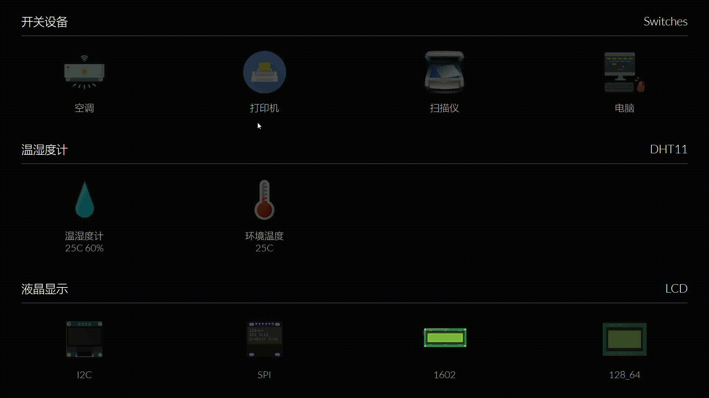

# Airkiss 一键配网

这是利用 Airkiss 进行一一键配网的固件源码和网页应用。

## 目录结构

| 目录     | 说明                 |
| -------- | -------------------- |
| firmware | esp8266 的固件源码   |
| webapp   | 网页应用的前后端源码 |

##  联系方式

- 维护：吴晗 张信峰
- 主页：<http://wuhanstudio.cc>
- 邮箱：[wuhanstudio@hust.edu.cn](mailto:wuhanstudio@hust.edu.cn)
